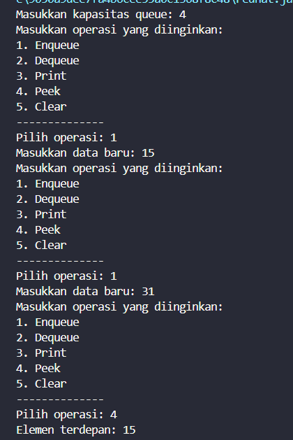

|  | Algorithm and Data Structure |
|--|--|
| **NIM** |  244107020051 |
| **Nama** |  Ahmad Zainudin Fanani |
| **Kelas** | TI - 1H |
| **Repository** | [GitHub Repository](https://github.com/Ahmad-Zainudin-Fanani/ALSD_1)

# Jobsheet 10
#### 2.1 Percobaan 1 : Operasi Dasar Queue


#### 2.1.3. Pertanyaan
**1. Pada konstruktor, mengapa nilai awal atribut front dan rear bernilai -1, sementara atribut size bernilai 0?**
- Atribut front dan rear diinisialisasi dengan nilai -1 karena ketika queue baru dibuat, belum terdapat elemen di dalamnya, sehingga keduanya belum mengarah ke indeks tertentu. Sementara itu, atribut size diberi nilai awal 0 karena pada kondisi awal, queue masih kosong dan belum memiliki data apa pun.

**2. Pada method Enqueue, jelaskan maksud dan kegunaan dari potongan kode berikut!**
```java
    if (rear == max -1){
        rear = 0;
```
- Ketika nilai rear sudah berada di posisi akhir array, yaitu saat rear bernilai max - 1, maka nilainya akan diatur ulang menjadi 0. Tujuan dari mekanisme ini adalah agar queue dapat bekerja secara melingkar (circular queue), sehingga elemen baru bisa dimasukkan kembali ke awal array, yakni indeks 0, asalkan masih ada ruang kosong yang tersedia.

**3. Pada method Dequeue, jelaskan maksud dan kegunaan dari potongan kode berikut!**
```java
    if (front == max - 1) {
        front = 0;
```
- Apabila front sudah berada di indeks terakhir array, yakni ketika nilainya sama dengan max - 1, maka nilainya akan dikembalikan ke 0. Langkah ini dilakukan untuk menjaga prinsip kerja circular queue, sehingga proses dequeue selanjutnya bisa mengambil data kembali dari indeks awal, yaitu indeks 0.

**4. Pada method print, mengapa pada proses perulangan variabel i tidak dimulai dari 0 (int i=0), melainkan int i=front?**
- Variabel i pada perulangan dimulai dari front karena letak front bisa berada di indeks mana saja, tidak selalu di 0, tergantung dari proses dequeue yang sudah dilakukan sebelumnya. Sebagai contoh, jika satu data telah dikeluarkan, maka posisi front akan bergeser ke indeks 1. Jika perulangan dimulai dari 0, maka data yang sebenarnya sudah tidak ada di dalam queue masih akan ikut ditampilkan. Dengan memulai dari front, hanya data yang masih ada di queue yang akan tercetak.

**5. Perhatikan kembali method print, jelaskan maksud dari potongan kode berikut!**
```java
    i = (i+1) % max;
```
- Potongan kode tersebut digunakan untuk menerapkan konsep circular queue, di mana dalam proses pencetakan data, nilai indeks i dihitung menggunakan rumus khusus agar dapat kembali ke awal array (indeks 0) saat telah mencapai indeks paling akhir. Dengan cara ini, data dalam queue bisa dibaca secara melingkar tanpa melebihi batas ukuran array.

**6. Tunjukkan potongan kode program yang merupakan queue overflow!**
```java
    if (isFull()) {
    System.out.println("Queue sudah penuh.");
}
```
**7. Pada saat terjadi queue overflow dan queue underflow program tersebut tetap dapat berjalan dan hanya menampilkan teks informasi. Lakukan modifikasi program sehingga pada saat terjadi queue overflow dan queue underflow, program dihentikan!**
- Perubahan program dilakukan pada bagian fungsi Main, tepatnya di dalam switch case 1 dan 2, dengan menambahkan pengecekan kondisi apakah queue dalam keadaan penuh atau kosong. Berikut ini adalah
```java
    if (Q.isFull()) {
    System.out.println("Queue sudah penuh.");
    return;
}
```
dan 
```java
if (Q.isEmpty()) {
    System.out.println("Queue masih kosong.");
    return;
}
``` 
#### 2.2. Percobaan 2 : Antrian Layanan Akademik


#### 2.2.3 Pertanyaan
```java
    public void lihatAkhir() {
        if (IsEmpty()) {
            System.out.println("Antrian kosong.");
        } else {
            System.out.print("Mahasiswa terakhir: ");
            System.out.println("NIM - NAMA - PRODI - KELAS");
            data[rear].tampilkanData();
        }
    }
```

#### 2.3 Tugas

### 1. Mahasiswa02

Kelas ini merepresentasikan data mahasiswa yang terdiri dari atribut:

- `nim` : Nomor Induk Mahasiswa
- `nama` : Nama lengkap mahasiswa
- `prodi` : Program Studi
- `kelas` : Kelas mahasiswa

Konstruktor berfungsi untuk menginisialisasi atribut tersebut, serta method `tampilkanData()` menampilkan seluruh data mahasiswa dalam satu baris.

---

### 2. AntrianKRS

Kelas ini berperan sebagai struktur data antrian yang menyimpan mahasiswa yang akan diproses KRS. Beberapa atribut dan fungsinya adalah:

- Array `data[]` untuk menyimpan objek Mahasiswa.
- `front`, `rear`, `size`, `max` untuk mengelola posisi antrian.
- `kuota` untuk mengatur batas maksimum mahasiswa yang dapat diproses (default 30).

Fungsi utama meliputi:

- `tambahAntrian(Mahasiswa mhs)`: Menambahkan mahasiswa ke antrian jika belum penuh.
- `layaniMahasiswa()`: Memproses 2 mahasiswa terdepan sekaligus.
- `tampilkanSemua()`: Menampilkan daftar seluruh mahasiswa di antrian.
- Fungsi lain seperti `lihatDuaTerdepan()`, `lihatTerakhir()`, `clear()`, `getJumlahAntrian()`, `getMhsBelumProses()`, dan `getMhsSudahProses()` untuk menunjang pengelolaan antrian.

---

### 3. LayananKRS

Kelas ini berisi program utama yang menyediakan antarmuka interaktif bagi pengguna. Menu yang disediakan memungkinkan:

- Menambahkan mahasiswa ke antrian.
- Memproses dua mahasiswa sekaligus.
- Menampilkan seluruh antrian dan informasi terkait (jumlah, status proses).
- Mengosongkan antrian jika diperlukan.


