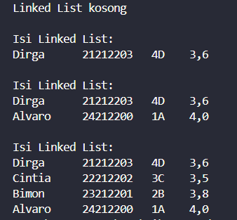
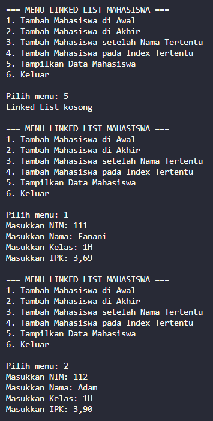
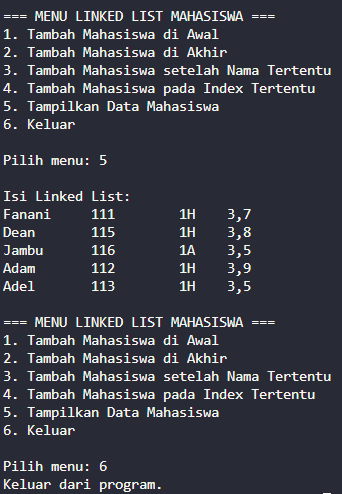
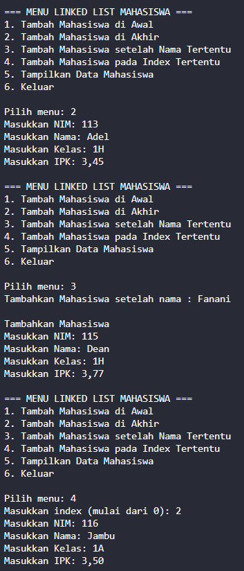
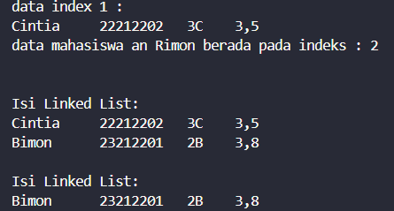
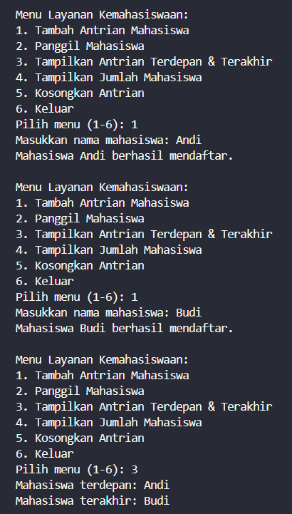
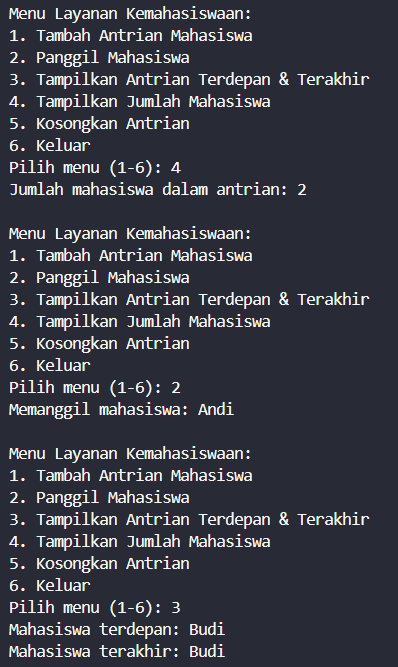
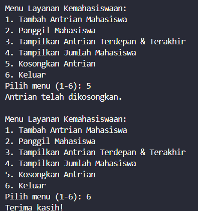

|  | Algorithm and Data Structure |
|--|--|
| **NIM** |  244107020051 |
| **Nama** |  Ahmad Zainudin Fanani |
| **Kelas** | TI - 1H |
| **Repository** | [GitHub Repository](https://github.com/Ahmad-Zainudin-Fanani/ALSD_1)

# Jobsheet 11
#### 2.1 Pembuatan Single Linked List

#### 2.1.2 Pertanyaan

**1. Mengapa hasil compile kode program di baris pertama menghasilkan “Linked List Kosong”?**
- Karena objek belum diinstansiasi dan metode add juga belum dijalankan di awal.

**2. Jelaskan kegunaan variable temp secara umum pada setiap method!**
- Supaya bisa melakukan iterasi ke setiap node tanpa harus menggeser posisi head dan tail.

**3. Lakukan modifikasi agar data dapat ditambahkan dari keyboard!**

#### 2.2 Modifikasi Elemen pada Single Linked List 

#### 2.2.3 Pertanyaan

**1. Mengapa digunakan keyword break pada fungsi remove? Jelaskan!**
- Untuk mencegah eksekusi kode selanjutnya saat syarat pada if sudah dipenuhi.

**2. Jelaskan kegunaan kode dibawah pada method remove**
- Perpindahan dilakukan dari node setelah temp ke node selanjutnya, dan jika tidak ada node lagi setelahnya, maka temp dijadikan tail.

#### 3.Tugas

