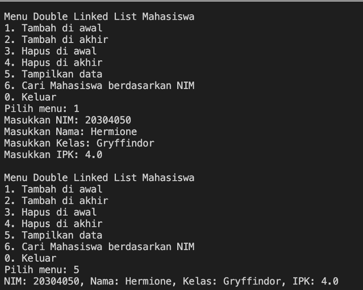
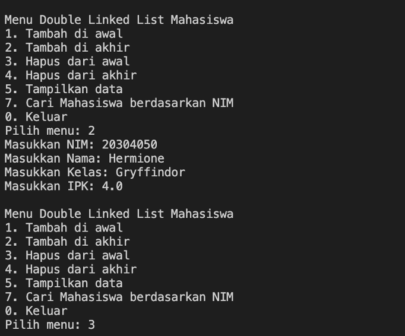
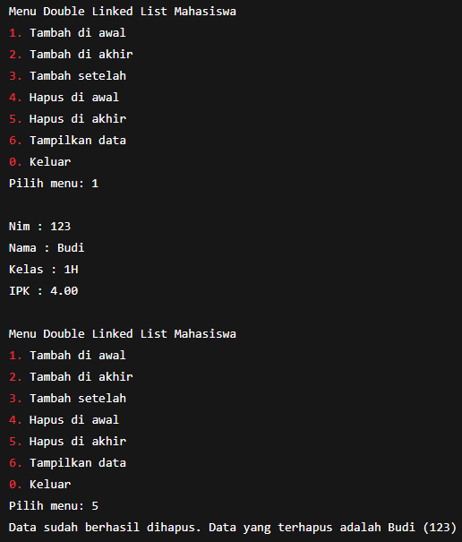
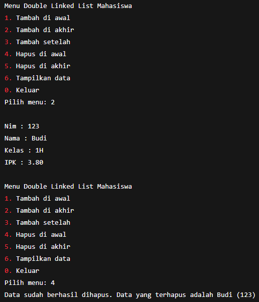
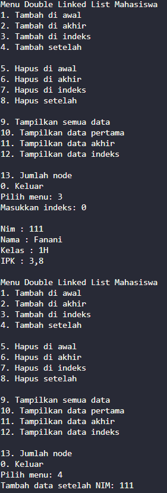
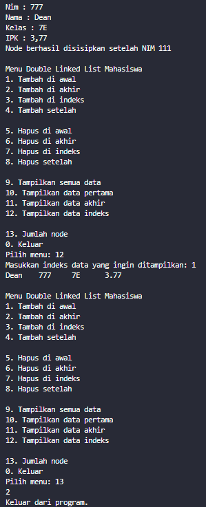
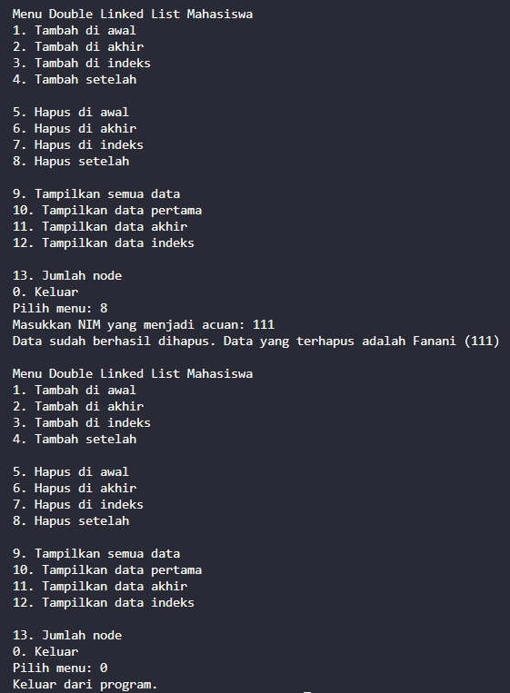

|  | Algorithm and Data Structure |
|--|--|
| **NIM** |  244107020051 |
| **Nama** |  Ahmad Zainudin Fanani |
| **Kelas** | TI - 1H |
| **Repository** | [GitHub Repository](https://github.com/Ahmad-Zainudin-Fanani/ALSD_1)

# Jobsheet 12

#### 12.2.1 Percobaan 1 




### **12.2.3 Pertanyaan Percobaan**

1. **Jelaskan perbedaan antara single linked list dengan double linked lists!**
- Double linked list memiliki dua pointer, sehingga bisa menjelajah data tidak hanya ke arah depan saja, tetapi juga ke belakang.
2. **Perhatikan class Node01, di dalamnya terdapat atribut next dan prev. Untuk apakah atribut tersebut?**
- Pointer next digunakan untuk menuju node berikutnya, sedangkan prev untuk kembali ke node sebelumnya.
3. **Perhatikan konstruktor pada class DoubleLinkedLists. Apa kegunaan dari konstruktor tersebut?**
- Pada saat pertama kali diinstansiasi, head dan tail diset dalam keadaan kosong.
4. **Pada method addFirst(), apa maksud dari kode berikut?**
- Menambahkan elemen baru dan menjadikannya node head.
5. **Perhatikan pada method addFirst(). Apakah arti statement head.prev = newNode ?**
- Menghubungkan pointer prev dari head ke node baru yang ditambahkan.
6. **Modifikasi code pada fungsi print() agar dapat menampilkan warning/ pesan bahwa linked lists masih dalam kondisi.**
```java
    if (isEmpty()) {
         System.out.println("Linked List Kosong");
   }
```
7. **Pada insertAfter(), apa maksud dari kode berikut ?**
- Node setelah current dihubungkan ke node baru melalui pointer prev.
8. **Modifikasi menu pilihan dan switch-case agar fungsi insertAfter() masuk ke dalam menu pilihan dan dapat berjalan dengan baik.**
```java
   case 4:
    System.out.print("Tambah data setelah NIM: ");
    String key = scan.nextLine();
    list.insertAfter(key, inputMahasiswa());
    size++;
    break;
```

---

## 2.2 Modifikasi Elemen pada Single Linked List



### **2.2.3 Pertanyaan**

1. **Mengapa digunakan keyword break pada fungsi remove? Jelaskan!**
- Supaya kode setelahnya tidak dieksekusi ketika kondisi if telah terpenuhi.
2. **Modifikasi kode program untuk menampilkan pesan “Data sudah berhasil dihapus. Data yang terhapus adalah … “**



---

## 3. Tugas


