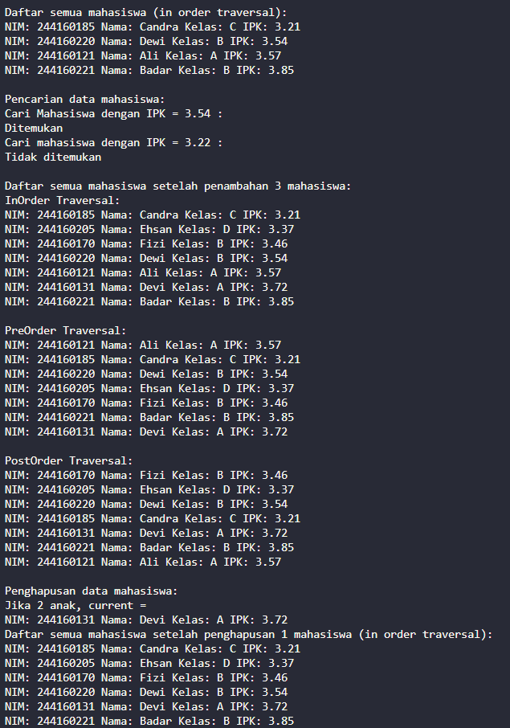
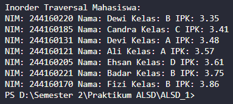

|  | Algorithm and Data Structure |
|--|--|
| **NIM** |  244107020051 |
| **Nama** |  Ahmad Zainudin Fanani |
| **Kelas** | TI - 1H |
| **Repository** | [GitHub Repository](https://github.com/Ahmad-Zainudin-Fanani/ALSD_1)

# Jobsheet 13

## 14.2.1 Percobaan 1



### 14.2.2 Pertanyaan Percobaan

1. **Mengapa dalam binary search tree proses pencarian data bisa lebih efektif dilakukan dibanding binary tree biasa?**
- Karena pada BST nilai child kiri selalu lebih kecil dari parent dan child kanan lebih besar, maka pencarian data menjadi lebih cepat dan efisien.
2. **Untuk apakah di class Node, kegunaan dari atribut left dan right?**
- Untuk berpindah ke child kiri atau kanan
3. **a. Untuk apakah kegunaan dari atribut root di dalam class BinaryTree?**
- Node tertinggi atau root dijadikan referensi utama saat menjalankan proses lainnya dalam struktur tree.
    **b. Ketika objek tree pertama kali dibuat, apakah nilai dari root?**
- Jika pada konstruktor nilai root diset ke null, maka tree dianggap masih kosong.
4. **Ketika tree masih kosong, dan akan ditambahkan sebuah node baru, proses apa yang akan terjadi?**
- Menambahkan data baru sebagai node root.
5. **Perhatikan method add(), di dalamnya terdapat baris program seperti di bawah ini. Jelaskan secara detil untuk apa baris program tersebut?**
- Node baru ditambahkan ke posisi kosong di kiri atau kanan parent berdasarkan nilai yang lebih kecil atau lebih besar.
6. **Jelaskan langkah-langkah pada method delete() saat menghapus sebuah node yang memiliki dua anak. Bagaimana method getSuccessor() membantu dalam proses ini?**
- Cari node anak paling kiri dari subtree kanan current, lalu pindahkan anak kiri current menjadi anak kiri dari node tersebut, dan akhirnya ganti posisi anak kanan current menjadi node current yang baru.

---

## 14.3.1 Tahapan Percobaan



### 2.2.3 Pertanyaan

1. **Apakah kegunaan dari atribut data dan idxLast yang ada di class BinaryTreeArray?**
- data merupakan array yang berisi objek dari class Mahasiswa, sedangkan idxLast berfungsi sebagai penanda indeks terakhir yang terisi dalam array tersebut.
2. **Apakah kegunaan dari method populateData()?**
- Digunakan untuk mengisi elemen pada array data dan memperbarui nilai idxLast sesuai posisi data terakhir yang dimasukkan.
3. **Apakah kegunaan dari method traverseInOrder()?**
- Menampilkan isi tree secara rekursif dengan urutan traversal: anak kiri → akar → anak kanan (in-order traversal).
4. **Jika suatu node binary tree disimpan dalam array indeks 2, maka di indeks berapakah posisileft child dan rigth child masing-masing?**
- 5 dan 6
5. **Apa kegunaan statement int idxLast = 6 pada praktikum 2 percobaan nomor 4?**
- idxLast digunakan sebagai penanda bahwa indeks tersebut merupakan posisi terakhir dari data yang ada dalam array.
6. **Mengapa indeks 2*idxStart+1 dan 2*idxStart+2 digunakan dalam pemanggilan rekursif, dan apa kaitannya dengan struktur pohon biner yang disusun dalam array?**
- 2 * idxStart + 1 menunjukkan indeks anak kiri dari suatu parent, sedangkan 2 * idxStart + 2 menunjukkan indeks anak kanan dari parent.

---

## 3. Tugas

1. 
```java
    public void addRekursif(Mahasiswa02 mhs) {
    root = tambahRekursif(root, mhs);
}

private Node02 tambahRekursif(Node02 current, Mahasiswa02 mhs) {
    if (current == null) {
        return new Node02(mhs);
    }

    if (mhs.ipk < current.mahasiswa.ipk) {
        current.left = tambahRekursif(current.left, mhs);
    } else {
        current.right = tambahRekursif(current.right, mhs);
    }
    return current;
}
```

2.
```java
    public Mahasiswa02 cariMinIPK() {
    if (isEmpty()) return null;

    Node02 current = root;
    while (current.left != null) {
        current = current.left;
    }
    return current.mahasiswa;
}

public Mahasiswa02 cariMaxIPK() {
    if (isEmpty()) return null;

    Node02 current = root;
    while (current.right != null) {
        current = current.right;
    }
    return current.mahasiswa;
}

public void tampilMahasiswaIPKdiAtas(double ipkBatas) {
    tampilIPKLebih(root, ipkBatas);
}

private void tampilIPKLebih(Node02 node, double ipkBatas) {
    if (node != null) {
        tampilIPKLebih(node.left, ipkBatas);
        if (node.mahasiswa.ipk > ipkBatas) {
            node.mahasiswa.tampilInformasi();
        }
        tampilIPKLebih(node.right, ipkBatas);
    }
}
```

3.
```java
    void add(Mahasiswa02 data) {
    if (idxLast + 1 < dataMahasiswa.length) {
        idxLast++;
        dataMahasiswa[idxLast] = data;
    } else {
        System.out.println("Tree penuh, tidak bisa menambah data.");
    }
}

void traversePreOrder(int idxStart) {
    if (idxStart <= idxLast) {
        if (dataMahasiswa[idxStart] != null) {
            dataMahasiswa[idxStart].tampilInformasi();
            traversePreOrder(2 * idxStart + 1); 
            traversePreOrder(2 * idxStart + 2); 
        }
    }
}
```