|  | Algorithm and Data Structure |
|--|--|
| **NIM** |  244107020051 |
| **Nama** |  Ahmad Zainudin Fanani |
| **Kelas** | TI - 1H |
| **Repository** | [GitHub Repository](https://github.com/Ahmad-Zainudin-Fanani/ALSD_1)

# Jobsheet 3

## 3.2 Membuat Array dari Object, Mengisi dan Menampilkan

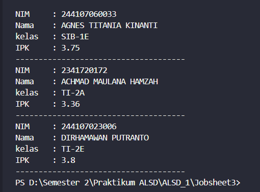

1. **Berdasarkan uji coba 3.2, apakah class yang akan dibuat array of object harus selalu memiliki atribut dan sekaligus method? Jelaskan!**
- Jawaban: Tidak, class yang akan dibuat array of object tidak harus memiliki atrib
2. **Apa yang dilakukan oleh kode program berikut?**
- Jawaban: deklarasi array of object arrayOfMahasiswa dari class Mahasiswa
3. **Apakah class Mahasiswa memiliki konstruktor? Jika tidak, kenapa bisa dilakukan pemanggilan konstruktur pada baris program berikut?**
- jawaban: Jika sebuah class tidak memiliki konstruktor, maka secara otomatis akan dibuatkan konstruktor default tanpa parameter.
4. **Apa yang dilakukan oleh kode program berikut?**
- Jawaban: Pemberian nilai pada elemen indeks 0 dalam array objek arrayOfMahasiswa.
5. **Mengapa class Mahasiswa dan MahasiswaDemo dipisahkan pada uji coba 3.2?**
- Jawaban: Karena class Mahasiswa dan MahasiswaDemo memiliki tujuan yang berbeda

---

## 3.3 Menerima Input Isian Array Menggunakan Looping

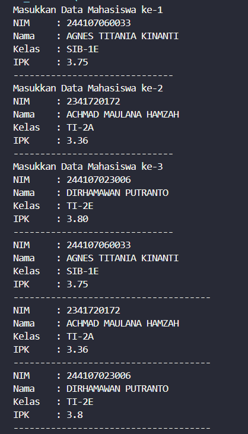

1. **Tambahkan method cetakInfo() pada class Mahasiswa kemudian modifikasi kode program pada langkah no 3.**
- 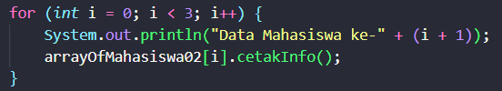
- 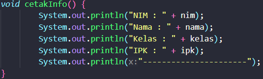
2.**Misalkan Anda punya array baru bertipe array of Mahasiswa dengan nama myArrayOfMahasiswa. Mengapa kode berikut menyebabkan error?**
- Jawaban: karena objek didalam array belum di instansiasi.

---

## 3.4 Constructor Berparameter 

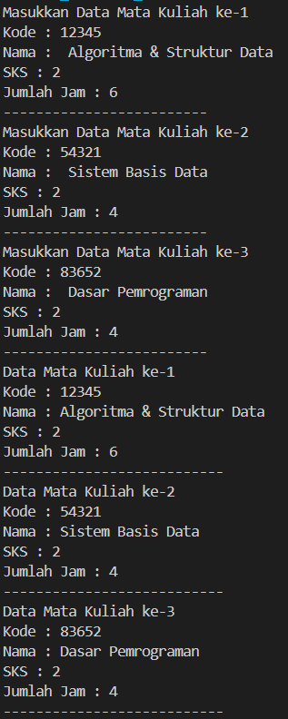

1. **Apakah suatu class dapat memiliki lebih dari 1 constructor? Jika iya, berikan contohnya**
    - Jawaban: Ya, suatu class dapat memiliki lebih dari 1 constructor.
     Contoh: 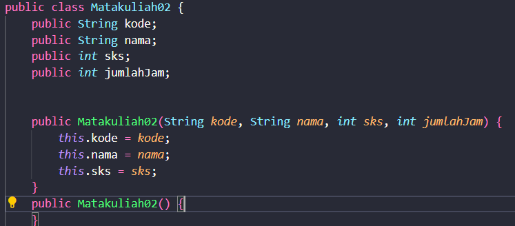
2. **Tambahkan method `tambahData()` pada class `Matakuliah`, kemudian gunakan method tersebut di class `MatakuliahDemo` untuk menambahkan data Matakuliah**
    - 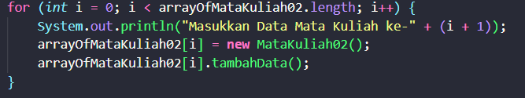
      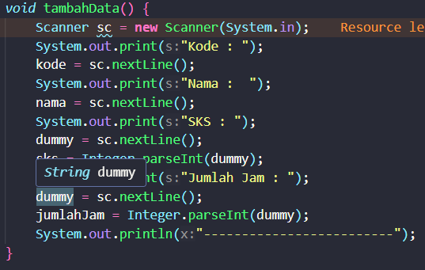
3. **Tambahkan method `cetakInfo()` pada class `Matakuliah`, kemudian gunakan method tersebut di class `MatakuliahDemo` untuk menampilkan data hasil inputan di layar**
    - 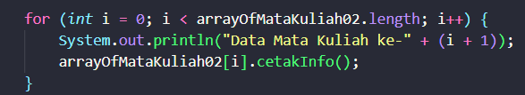
      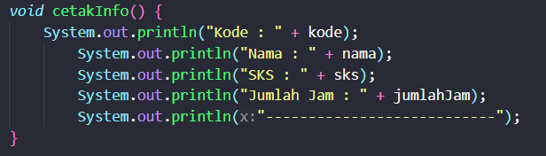
4. **Modifikasi kode program pada class `MatakuliahDemo` agar panjang (jumlah elemen) dari `array of object` Matakuliah ditentukan oleh user melalui input dengan Scanner**
    - 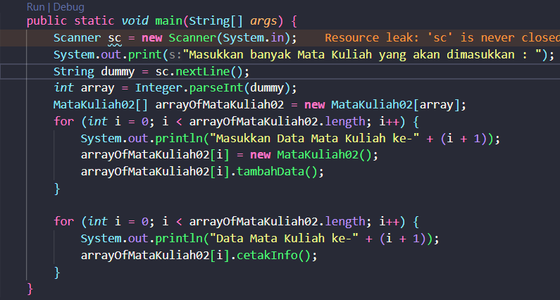

---

## 3.5 Tugas

- 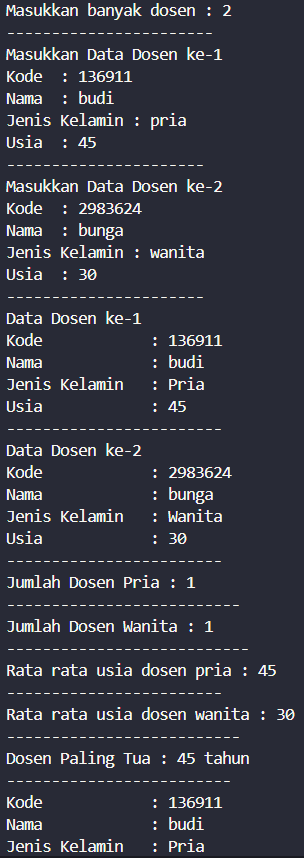
- 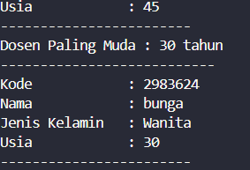