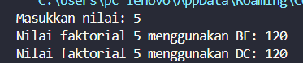
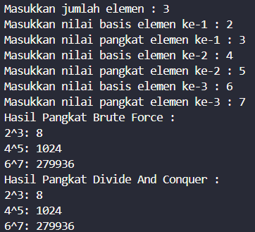
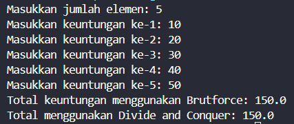
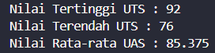

|  | Algorithm and Data Structure |
|--|--|
| **NIM** |  244107020051 |
| **Nama** |  Ahmad Zainudin Fanani |
| **Kelas** | TI - 1H |
| **Repository** | [GitHub Repository](https://github.com/Ahmad-Zainudin-Fanani/ALSD_1)

# Jobsheet 5

## 5.2 Menghitung Nilai Faktorial dengan Algoritma Brute Force dan Divide and Conquer



### **5.2.3. Pertanyaan**

1. **Pada base line Algoritma Divide Conquer untuk melakukan pencarian nilai faktorial, jelaskan perbedaan bagian kode pada penggunaan if dan else!**
- Jika kondisi n == 1 terpenuhi, maka bagian if akan dijalankan sebagai base case untuk menghentikan rekursi.
- Sebaliknya, jika kondisi tidak memenuhi if, maka bagian else akan dieksekusi untuk melanjutkan rekursi dengan memecah masalah menjadi bagian yang lebih kecil hingga akhirnya mencapai base case.
2. **Apakah memungkinkan perulangan pada method faktorialBF() diubah selain menggunakan for? Buktikan!**
   ```java
     while (i <= n) {
              fakto = fakto * i;
              i++;
          }
   ```
3. **Jelaskan perbedaan antara fakto _= i; dan int fakto = n _ faktorialDC(n-1); !**
- fakto *= i digunakan dalam metode iteratif dengan pendekatan Brute Force menggunakan perulangan.
- fakto = n * faktorialDC(n-1); digunakan dalam metode rekursif dengan pendekatan Divide and Conquer, di mana fungsi akan memanggil dirinya sendiri hingga mencapai base case.
4. **Buat Kesimpulan tentang perbedaan cara kerja method faktorialBF() dan faktorialDC()!**
- faktorialBF menghitung faktorial dengan menggunakan perulangan langsung di dalam metode.
- faktorialDC menyelesaikan masalah dengan membaginya menjadi bagian yang lebih kecil melalui pemanggilan rekursif hingga mencapai base case.

---

## 5.3 Menghitung Hasil Pangkat dengan Algoritma Brute Force dan Divide and Conquer



### **5.3.3 Pertanyaan**

1. **Jelaskan mengenai perbedaan 2 method yang dibuat yaitu pangkatBF() dan pangkatDC()!**
- pangkatBF() menghitung perpangkatan dengan pendekatan Brute Force menggunakan perulangan for.
- pangkatDC() menerapkan metode Divide and Conquer dengan memecah masalah melalui pemanggilan rekursif hingga mencapai base case.
2. **Apakah tahap combine sudah termasuk dalam kode tersebut?Tunjukkan!**
- Jika pangkatDC() telah mencapai base case, maka fungsi akan mengembalikan nilai a dan hasilnya akan dikalikan secara berurutan dengan semua pemanggilan rekursif sebelumnya hingga mendapatkan nilai akhir.
```java
     int pangkatDC(int a, int n) {
        if (n==1) {
            return a;
        } else {
            if (n%2==1) {
                return (pangkatDC(a, n / 2) * pangkatDC(a, n / 2) * a);
            } else {
                return  (pangkatDC(a, n / 2) * pangkatDC(a, n / 2));
            }
        }
    }
   ```
3. **Pada method pangkatBF() terdapat parameter untuk melewatkan nilai yang akan dipangkatkan dan pangkat berapa, padahal di sisi lain di class Pangkat telah ada atribut nilai dan pangkat, apakah menurut Anda method tersebut tetap relevan untuk memiliki parameter? Apakah bisa jika method tersebut dibuat dengan tanpa parameter? Jika bisa, seperti apa method pangkatBF() yang tanpa parameter?**
```java
       int pangkatBF() {
        int hasil = 1;
        for (int i = 0; i < pangkat; i++) {
            hasil = hasil * nilai;
        }
        return hasil;
      }
   ```
4. **Tarik tentang cara kerja method pangkatBF() dan pangkatDC()!**
- pangkatBF() menerapkan metode Brute Force dengan melakukan perkalian berulang sebanyak nilai pangkat menggunakan perulangan di dalam metode.
- pangkatDC() menggunakan pendekatan Divide and Conquer dengan memanggil metode secara rekursif untuk menghasilkan nilai yang kemudian dikalikan sesuai dengan pangkat yang diberikan.

---

## 5.4 Menghitung Sum Array dengan Algoritma Brute Force dan Divide and Conquer



### **5.4.3 Pertanyaan**

1. **Kenapa dibutuhkan variable mid pada method TotalDC()?**
- Memisahkan array menjadi dua bagian, yaitu kiri dan kanan, sebagai langkah awal dalam metode Divide and Conquer.
2. **Untuk apakah statement di bawah ini dilakukan dalam TotalDC()?**
- Melakukan pemanggilan rekursif pada metode untuk terus membagi array hingga mencapai base case.
3. **Kenapa diperlukan penjumlahan hasil lsum dan rsum seperti di bawah ini?**
- Menggabungkan hasil dari setiap pemanggilan rekursif untuk mendapatkan output akhir yang diinginkan.
4. **Apakah base case dari totalDC()?**
- Proses rekursi terus membagi array hingga tersisa satu indeks, yang kemudian dikembalikan ke pemanggilan sebelumnya.
5. **Tarik Kesimpulan tentang cara kerja totalDC()**
- Array yang diberikan sebagai parameter dibagi menjadi dua bagian, kemudian rekursi dipanggil untuk terus membagi hingga mencapai base case, dan akhirnya semua indeks dalam array dijumlahkan sebelum dikembalikan.

---

## 4.5 Latihan Praktikum

