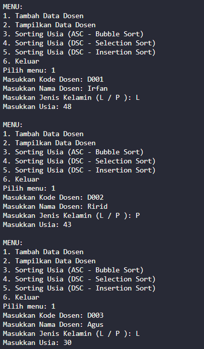

|  | Algorithm and Data Structure |
|--|--|
| **NIM** |  244107020051 |
| **Nama** |  Ahmad Zainudin Fanani |
| **Kelas** | TI - 1H |
| **Repository** | [GitHub Repository](https://github.com/Ahmad-Zainudin-Fanani/ALSD_1)

# Jobsheet 6

## 6.2 Praktikum 1 - Mengimplementasikan Sorting menggunakan object


###  **5.2.5 Pertanyaan!**

1. **Jelaskan fungsi kode program berikut**
```java
    if (data[j-1]>data[j]){
        temp=data[j];
        data[j]=data[j-1];
        data[j-1]=temp;
        }
```
- Jika nilai pada indeks sebelumnya (-1) lebih besar dari nilai pada indeks saat ini, maka simpan sementara nilai indeks saat ini ke dalam variabel temp, gantikan nilai indeks saat ini dengan nilai indeks sebelumnya, lalu masukkan nilai temp ke indeks sebelumnya.

2. **Tunjukkan kode program yang merupakan algoritma pencarian nilai minimum pada selection sort!**
```java
      int min = i;
      for (int j = i + 1; j < jumData; j++) {
            if (data[j] < data[min]) {
               min = j;
            }
      }
```
3. **Pada Insertion sort , jelaskan maksud dari kondisi pada perulangan**
- Selama nilai j masih lebih besar atau sama dengan 0 dan elemen pada indeks j lebih besar dari temp, pindahkan nilai dari indeks j ke indeks j+1, lalu kurangi nilai j.
4. **Buat Kesimpulan tentang perbedaan cara kerja method faktorialBF() dan faktorialDC()!**
- Memindahkan nilai yang lebih besar ke posisi indeks berikutnya (+1).

---

## 5.3 Praktikum 2- (Sorting Menggunakan Array of Object)


### **5.3.4 Pertanyaan**

1. **Perhatikan perulangan di dalam bubbleSort() di bawah ini:**
    a. **Mengapa syarat dari perulangan i adalah ?**
   ```java
      i<listMhs.length-1
   ```
Dalam Bubble Sort, setelah proses penyortiran atau iterasi dilakukan sebanyak n-1 kali, elemen terbesar secara otomatis sudah berada di posisi akhirnya yang benar.
    b. **Mengapa syarat dari perulangan j adalah**
   ```java
      j<listMhs.length-i
   ```
Untuk menghindari perbandingan dengan elemen yang sudah berada di posisi yang benar, cukup kurangi jumlah elemen yang dibandingkan pada setiap iterasi.
c. **Jika  banyak  data  di  dalam  listMhs  adalah  50,  maka berapakali perulangan i akan berlangsung? Dan ada berapa Tahap bubble sort yang ditempuh?**
Perulangan `i` berjalan sebanyak 49 kali, yang berarti terdapat 49 tahap dalam proses Bubble Sort.

2. **Modifikasi program diatas dimana data mahasiswa bersifat dinamis (input dari keyborad) yang terdiri dari nim, nama, kelas, dan ipk!**
   

   

## 5.3.5 Mengurutkan Data Mahasiswa Berdasarkan IPK (Selection Sort)

 

 ### **5.4.3 Pertanyaan**

1. **Ubahlah fungsi pada InsertionSort sehingga fungsi ini dapat melaksanakan proses sorting dengan cara descending.**
   


---

## 5.5 Latihan Praktikum




