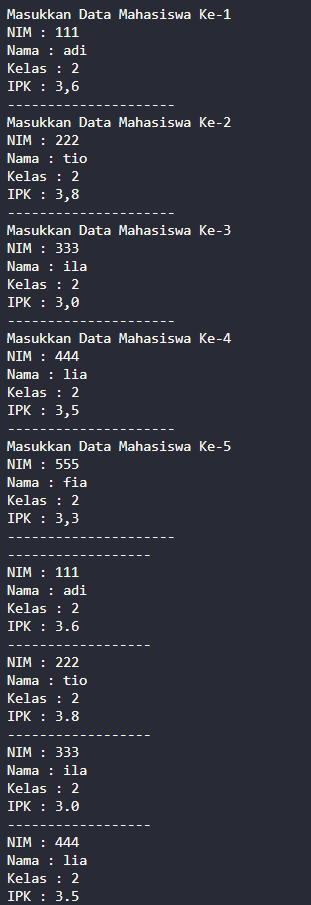
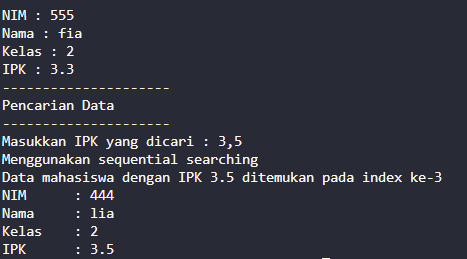
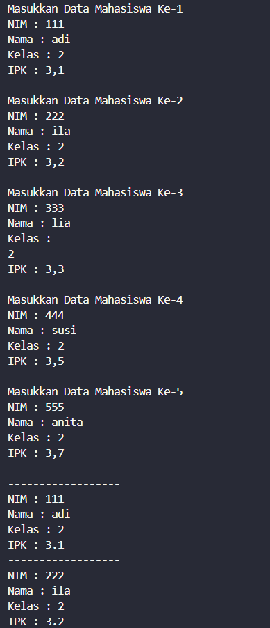
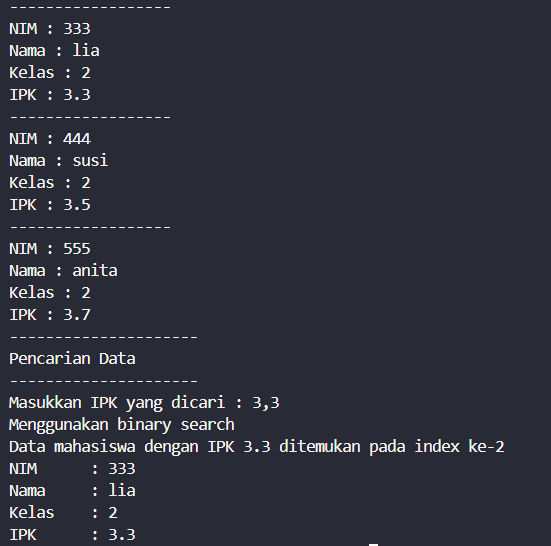
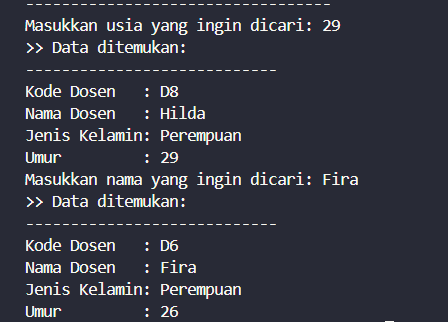

|  | Algorithm and Data Structure |
|--|--|
| **NIM** |  244107020051 |
| **Nama** |  Ahmad Zainudin Fanani |
| **Kelas** | TI - 1H |
| **Repository** | [GitHub Repository](https://github.com/Ahmad-Zainudin-Fanani/ALSD_1)

# Jobsheet 7

## 6.2 Searching menggunakan sequential searching

#### 6.2.2 Verifikasi Percobaan





#### 6.2.3 Pertanyaan

1. **Jelaskan perbedaan metod tampilDataSearch dan tampilPosisi pada class MahasiswaBerprestasi!**
- TampilPosisi() Menunjukkan letak (indeks) data mahasiswa dalam array berdasarkan nilai IPK yang dicari.
- TampilDataSearch() Menampilkan data mahasiswa yang memiliki nilai IPK tertentu.

2. **Jelaskan fungsi break pada kode program**
- Break Berfungsi untuk menghentikan pencarian ketika sudah menemukan nilai ipk mahasiswa dengan nilai yang diberikan.

#### 6.3.2 Verifikasi Percobaan





#### 6.3.3 Pertanyaan

1. **Tunjukkan pada kode program yang mana proses divide dijalankan!**
- Bagian divide terdapat pada baris mid = (left + right) / 2;, yang berfungsi untuk membagi ruang pencarian menjadi dua bagian.
2. **Tunjukkan pada kode program yang mana proses conquer dijalankan!**
- Bagian conquer terletak pada bagian kode ini
```java
  if (cari == listMhs[mid].ipk) {
    return mid;
  } else if (listMhs[mid].ipk > cari) {
    return findBinarySearch(cari, left, mid - 1);
  } else {
    return findBinarySearch(cari, mid + 1, right);
  }
```
3. **Jika data IPK yang dimasukkan tidak urut. Apakah program masih dapat berjalan? Mengapa demikian!**
- Algoritma ini tidak akan berjalan sebagaimana mestinya jika kondisi urutan data tidak sesuai, karena dalam proses conquer, pengambilan keputusan didasarkan pada perbandingan data di tengah dengan nilai yang dicari.
4. **Jika IPK yang dimasukkan dari IPK terbesar ke terkecil (missal : 3.8, 3.7, 3.5, 3.4, 3.2) dan elemen yang dicari adalah 3.2. Bagaimana hasil dari binary search? Apakah sesuai? Jika tidak sesuai maka ubahlah kode program binary seach agar hasilnya sesuai**
- Jika data yang digunakan disusun secara menurun (descending), maka algoritma ini gagal bekerja dengan benar karena logika perbandingannya hanya cocok untuk data yang tersusun naik (ascending). Penyesuaian perlu dilakukan seperti dalam kode berikut agar sesuai dengan urutan data :
```java
    public int findBinarySearch(double cari, int left, int right) {
        int mid;
        if (right >= left) {
            mid = (left + right) / 2;
            if (cari == listMhs[mid].ipk) {
                return mid;
            } else if (listMhs[mid].ipk < cari) {
                return findBinarySearchDescending(cari, left, mid - 1); 
            } else {
                return findBinarySearchDescending(cari, mid + 1, right);
            }
        } else {
            return -1;
        }
    }
```
5. **Modifikasilah program diatas yang mana jumlah mahasiswa yang di inputkan sesuai dengan masukan dari keyboard.**
- untuk mengubah seperti yang diinginkan, saya memilih untuk menggunakan konstruktor berparameter untuk menghindari memory leak. kode yang tertera dalam file [MahasiswaBerprestasi02.java](./MahasiswaBerprestasi02.java) dan [MahasiswaDemo02](./MahasiswaDemo02.java) merupakan kode yang diubah untuk dapat memasukkan jumlah mahasiswa sesuai input dari keyboard user

### 6.5 Latihan Praktikum


