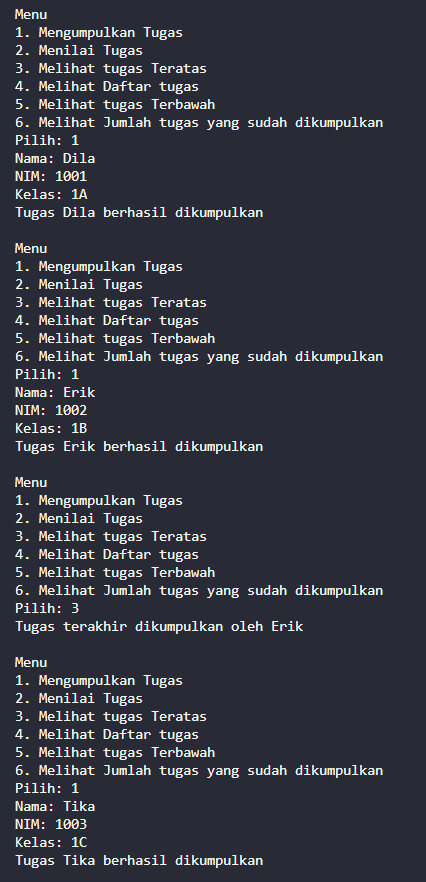
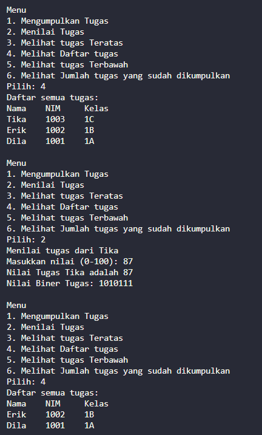
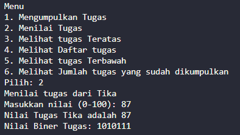
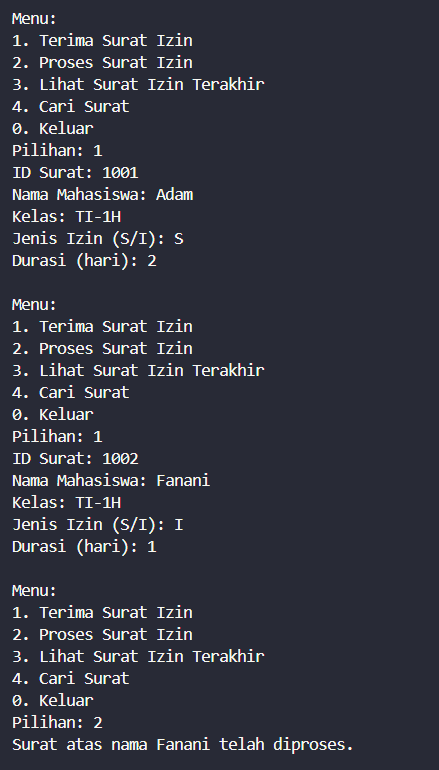

|  | Algorithm and Data Structure |
|--|--|
| **NIM** |  244107020051 |
| **Nama** |  Ahmad Zainudin Fanani |
| **Kelas** | TI - 1H |
| **Repository** | [GitHub Repository](https://github.com/Ahmad-Zainudin-Fanani/ALSD_1)

# Jobsheet 9
#### 2.1.1 Langkah-langkah Percobaan




#### 2.1.3 Pertanyaan
1. **Lakukan perbaikan pada kode program, sehingga keluaran yang dihasilkan sama dengan verifikasi hasil percobaan! Bagian mana yang perlu diperbaiki?**
```java
    public void print() {
        if (!isEmpty()) {
            for (int i = top; i >= 0; i--) {
                System.out.println(stack[i].nama + "\t" + stack[i].nim + "\t" + stack[i].kelas);
            }
            System.out.println();
        } else {
            System.out.println("Tidak ada tugas dalam daftar.");
        }
    }
```
2. **Berapa banyak data tugas mahasiswa yang dapat ditampung di dalam Stack? Tunjukkan potongan kode programnya!**
- bisa menampung maksimal 5 tugas mahasiswa.
```java
    StackTugasMahasiswa02 stack = new StackTugasMahasiswa02(5);
```
3. **Mengapa perlu pengecekan kondisi !isFull() pada method push? Kalau kondisi if-else tersebut dihapus, apa dampaknya?**
- Pengecekan !isFull() pada method push() penting untuk mencegah penambahan data saat stack penuh. Tanpa pengecekan ini, program bisa error karena mengakses indeks di luar batas array.
4. **Modifikasi kode program pada class MahasiswaDemo dan StackTugasMahasiswa sehingga pengguna juga dapat melihat mahasiswa yang pertama kali mengumpulkan tugas melalui operasi lihat tugas terbawah!**

-
1. Modifikasi MahasiswaDemo02.java
```java
//Tambahan bagian menu
System.out.println("5. Melihat tugas Terbawah");

//Tambahkan case baru di Switch
case 5:
    Mahasiswa02 terbawah = stack.bottom();
    if (terbawah != null) {
        System.out.println("Tugas pertama dikumpulkan oleh " + terbawah.nama);
    }
    break;

//Update batas perulangan do-while
} while (pilih >= 1 && pilih <= 5);

```
  2. Modifikasi StackTugasMahasiswa02.java
```java
    public Mahasiswa02 bottom() {
    if (top >= 0) {
        return stack[0]; 
    } else {
        System.out.println("Stack kosong!");
        return null;
    }
}
```

5. **Tambahkan method untuk dapat menghitung berapa banyak tugas yang sudah dikumpulkan saat ini, serta tambahkan operasi menunya!**


```java
    //Menghitung berapa banyak tugas yang sudah dikumpulkan
    public int count() {
        return top + 1; // karena top dimulai dari -1, jadi jumlah tugas adalah top + 1
    }
    //Tambahan bagian menu
    System.out.println("6. Melihat Jumlah tugas yang sudah dikumpulkan");

    //Update batas perulangan do-while
    } while (pilih >= 1 && pilih <= 6);
```

#### 2.2.1 Langkah-langkah Percobaan


#### 2.2.3 Pertanyaan
1. **Jelaskan alur kerja dari method konversiDesimalKeBiner!**
- Method `konversiDesimalKeBiner` dipakai buat ngubah angka desimal jadi biner dengan cara membagi angkanya terus-menerus dengan 2, lalu tiap sisa bagi ditaruh di depan hasil. Proses ini diulang sampai angkanya habis, dan hasil akhirnya dikembalikan sebagai bilangan biner.

2. **Pada method konversiDesimalKeBiner, ubah kondisi perulangan menjadi while (kode != 0), bagaimana hasilnya? Jelaskan alasannya!**
- Hasilnya bakal sama aja bakal selama bernilai positif

#### 2.4 Latihan Praktikum


